# Udacity - Intro to Machine Learning
__________________________________________________________________________

## ENRON SCANDAL

[Summary link - Wikipedia](https://en.wikipedia.org/wiki/Enron_scandal)

>The Enron scandal was a financial scandal that eventually led to the bankruptcy of the Enron Corporation, an American energy company based in Houston, Texas, and the de facto dissolution of Arthur Andersen, which was one of the five largest audit and accountancy partnerships in the world. In addition to being the largest bankruptcy reorganization in American history at that time, Enron was cited as the biggest audit failure.

>Enron was formed in 1985 by Kenneth Lay after merging Houston Natural Gas and InterNorth. Several years later, when Jeffrey Skilling was hired, he developed a staff of executives that – by the use of accounting loopholes, special purpose entities, and poor financial reporting – were able to hide billions of dollars in debt from failed deals and projects. Chief Financial Officer Andrew Fastow and other executives not only misled Enron's Board of Directors and Audit Committee on high-risk accounting practices, but also pressured Arthur Andersen to ignore the issues.

>Enron shareholders filed a 40 billion dollar lawsuit after the company's stock price, which achieved a high of US90.75 per share in mid-2000, plummeted to less than 1 dollar by the end of November 2001. The U.S. Securities and Exchange Commission (SEC) began an investigation, and rival Houston competitor Dynegy offered to purchase the company at a very low price. The deal failed, and on December 2, 2001, Enron filed for bankruptcy under Chapter 11 of the United States Bankruptcy Code. Enron's 63.4 billion dollars in assets made it the largest corporate bankruptcy in U.S. history until WorldCom's bankruptcy the next year.

>Many executives at Enron were indicted for a variety of charges and some were later sentenced to prison. Enron's auditor, Arthur Andersen, was found guilty in a United States District Court of illegally destroying documents relevant to the SEC investigation which voided its license to audit public companies, effectively closing the business. By the time the ruling was overturned at the U.S. Supreme Court, the company had lost the majority of its customers and had ceased operating. Enron employees and shareholders received limited returns in lawsuits, despite losing billions in pensions and stock prices. As a consequence of the scandal, new regulations and legislation were enacted to expand the accuracy of financial reporting for public companies. One piece of legislation, the Sarbanes–Oxley Act, increased penalties for destroying, altering, or fabricating records in federal investigations or for attempting to defraud shareholders. The act also increased the accountability of auditing firms to remain unbiased and independent of their clients.

[EnronCEO Picture]('EnronCEO.png')
<br>
[Trial of Ken Lay and Jeff Skilling](https://en.wikipedia.org/wiki/Trial_of_Kenneth_Lay_and_Jeffrey_Skilling)
<br>


## Final Project: Identify Fraud from Enron Email
### By:  Marissa Schmucker
### May 2018

__________________________________________________________________________

<a id='top'></a>

Table of Contents
<br><br>
[Project Goal](#Goal) | 
<br>
[Dataset Questions](#Questions) | 
<br>
[Dataset Information](#Info) | 
<br>
[Feature Statistics](#Stats) |
<br>
[Explore Features](#Features) |
<br>
- [Salary](#Salary)
- [Bonus](#Bonus)
- [Total Payments](#Total Payments)
- [Exercised Stock Options](#Stock Options)
- [Total Stock Value](#Total Stock Value)
- [Total Bonus and Exercised Stock Options](#Total BE)
- [Total Payments and Stock Value in Millions](#Total Millions)
- [Shared Receipt with POI](#Shared Receipt)
- [To Messages](#To Messages)
- [From Messages](#From Messages)
- [Fraction to POI](#FTP)
- [Fraction from POI](#FFP)

<br>
[Outliers](#Outliers) | 
<br>
[Transform, Select, and Scale](#TSS) | 
<br>
[Algorithm Selection](#Algorithm) | 
<br>
[Parameter Tuning](#Tuning) | 
<br>
[Final Analysis](#Analysis) |
<br>
[Validating Our Analysis](#Validating) | 
<br>
[Evaluation Metrics](#Metrics) | 
<br>
[Final Thoughts](#Thoughts) | 
<br>
____________________________________________________________________________

<a id='Goal'></a>

## Project Goal

The goal of this project is to use the Enron dataset to train our machine learning algorithm to detect the possiblity of fraud (identify person's of interest.)  Since we know our persons of interest (POIs) in our dataset, we will be able to use supervised learning algorithms in constructing our POI identifier.  This will be done by picking the features within our dataset that separate our POIs from our non-POIs best.  
<br>
We will start out our analysis by answering some questions about our data.  Then, we will explore our features further by visualizing any correlations/outliers.  Next, we will transform/scale our features and select those that will be most useful in our POI identifier, engineering new features and adding them to the dataset if provided to be useful for our analysis.  We will identify at least two algorithms that may be best suited for our particular set of data and test them, tuning our parameters until optimal performance is reached.  In our final analysis, the algorithm we have fit will be validated using our training/testing data.  Using performance metrics to evaluate our analysis, any problems will be addressed and motifications made.  In our final thoughts, the performance of our final algorithm will be discussed. 
<br>


```python
"""Import pickle and sklearn to get started.
Load the data as enron_dict"""

import pickle
import sklearn

enron_dict = pickle.load(open("final_project_dataset.pkl", "r"))
```

<a id='Questions'></a>

## Dataset Questions

After getting our data dictionary loaded, we can start exploring our data.  We'll answer the following questions:
<br>
1. How many people do we have in our dataset?
2. What are their names?
3. What information do we have about these people?
4. Who are the POIs in our dataset?
5. Who are the highest earners?  Are they POIs?
6. Whos stock options had the highest value (max exercised_stock_options)?
7. Are there any features we can ignore due to missing data?
8. What is the mean salary for non-POIs and POIs?
9. What features might be useful for training our algorithm?
10. Are there any features we may need to scale?

[Top](#top)


```python
print 'Number of People in Dataset: ', len(enron_dict) 
```

    Number of People in Dataset:  146
    


```python
import pprint

pretty = pprint.PrettyPrinter()
```


```python
names = sorted(enron_dict.keys())  #sort names of Enron employees in dataset by first letter of last name

print 'Sorted list of Enron employees by last name'
pretty.pprint(names) 
```

    Sorted list of Enron employees by last name
    ['ALLEN PHILLIP K',
     'BADUM JAMES P',
     'BANNANTINE JAMES M',
     'BAXTER JOHN C',
     'BAY FRANKLIN R',
     'BAZELIDES PHILIP J',
     'BECK SALLY W',
     'BELDEN TIMOTHY N',
     'BELFER ROBERT',
     'BERBERIAN DAVID',
     'BERGSIEKER RICHARD P',
     'BHATNAGAR SANJAY',
     'BIBI PHILIPPE A',
     'BLACHMAN JEREMY M',
     'BLAKE JR. NORMAN P',
     'BOWEN JR RAYMOND M',
     'BROWN MICHAEL',
     'BUCHANAN HAROLD G',
     'BUTTS ROBERT H',
     'BUY RICHARD B',
     'CALGER CHRISTOPHER F',
     'CARTER REBECCA C',
     'CAUSEY RICHARD A',
     'CHAN RONNIE',
     'CHRISTODOULOU DIOMEDES',
     'CLINE KENNETH W',
     'COLWELL WESLEY',
     'CORDES WILLIAM R',
     'COX DAVID',
     'CUMBERLAND MICHAEL S',
     'DEFFNER JOSEPH M',
     'DELAINEY DAVID W',
     'DERRICK JR. JAMES V',
     'DETMERING TIMOTHY J',
     'DIETRICH JANET R',
     'DIMICHELE RICHARD G',
     'DODSON KEITH',
     'DONAHUE JR JEFFREY M',
     'DUNCAN JOHN H',
     'DURAN WILLIAM D',
     'ECHOLS JOHN B',
     'ELLIOTT STEVEN',
     'FALLON JAMES B',
     'FASTOW ANDREW S',
     'FITZGERALD JAY L',
     'FOWLER PEGGY',
     'FOY JOE',
     'FREVERT MARK A',
     'FUGH JOHN L',
     'GAHN ROBERT S',
     'GARLAND C KEVIN',
     'GATHMANN WILLIAM D',
     'GIBBS DANA R',
     'GILLIS JOHN',
     'GLISAN JR BEN F',
     'GOLD JOSEPH',
     'GRAMM WENDY L',
     'GRAY RODNEY',
     'HAEDICKE MARK E',
     'HANNON KEVIN P',
     'HAUG DAVID L',
     'HAYES ROBERT E',
     'HAYSLETT RODERICK J',
     'HERMANN ROBERT J',
     'HICKERSON GARY J',
     'HIRKO JOSEPH',
     'HORTON STANLEY C',
     'HUGHES JAMES A',
     'HUMPHREY GENE E',
     'IZZO LAWRENCE L',
     'JACKSON CHARLENE R',
     'JAEDICKE ROBERT',
     'KAMINSKI WINCENTY J',
     'KEAN STEVEN J',
     'KISHKILL JOSEPH G',
     'KITCHEN LOUISE',
     'KOENIG MARK E',
     'KOPPER MICHAEL J',
     'LAVORATO JOHN J',
     'LAY KENNETH L',
     'LEFF DANIEL P',
     'LEMAISTRE CHARLES',
     'LEWIS RICHARD',
     'LINDHOLM TOD A',
     'LOCKHART EUGENE E',
     'LOWRY CHARLES P',
     'MARTIN AMANDA K',
     'MCCARTY DANNY J',
     'MCCLELLAN GEORGE',
     'MCCONNELL MICHAEL S',
     'MCDONALD REBECCA',
     'MCMAHON JEFFREY',
     'MENDELSOHN JOHN',
     'METTS MARK',
     'MEYER JEROME J',
     'MEYER ROCKFORD G',
     'MORAN MICHAEL P',
     'MORDAUNT KRISTINA M',
     'MULLER MARK S',
     'MURRAY JULIA H',
     'NOLES JAMES L',
     'OLSON CINDY K',
     'OVERDYKE JR JERE C',
     'PAI LOU L',
     'PEREIRA PAULO V. FERRAZ',
     'PICKERING MARK R',
     'PIPER GREGORY F',
     'PIRO JIM',
     'POWERS WILLIAM',
     'PRENTICE JAMES',
     'REDMOND BRIAN L',
     'REYNOLDS LAWRENCE',
     'RICE KENNETH D',
     'RIEKER PAULA H',
     'SAVAGE FRANK',
     'SCRIMSHAW MATTHEW',
     'SHANKMAN JEFFREY A',
     'SHAPIRO RICHARD S',
     'SHARP VICTORIA T',
     'SHELBY REX',
     'SHERRICK JEFFREY B',
     'SHERRIFF JOHN R',
     'SKILLING JEFFREY K',
     'STABLER FRANK',
     'SULLIVAN-SHAKLOVITZ COLLEEN',
     'SUNDE MARTIN',
     'TAYLOR MITCHELL S',
     'THE TRAVEL AGENCY IN THE PARK',
     'THORN TERENCE H',
     'TILNEY ELIZABETH A',
     'TOTAL',
     'UMANOFF ADAM S',
     'URQUHART JOHN A',
     'WAKEHAM JOHN',
     'WALLS JR ROBERT H',
     'WALTERS GARETH W',
     'WASAFF GEORGE',
     'WESTFAHL RICHARD K',
     'WHALEY DAVID A',
     'WHALLEY LAWRENCE G',
     'WHITE JR THOMAS E',
     'WINOKUR JR. HERBERT S',
     'WODRASKA JOHN',
     'WROBEL BRUCE',
     'YEAGER F SCOTT',
     'YEAP SOON']
    


```python
print 'Example Value Dictionary of Features'
pretty.pprint(enron_dict['ALLEN PHILLIP K']) 
```

    Example Value Dictionary of Features
    {'bonus': 4175000,
     'deferral_payments': 2869717,
     'deferred_income': -3081055,
     'director_fees': 'NaN',
     'email_address': 'phillip.allen@enron.com',
     'exercised_stock_options': 1729541,
     'expenses': 13868,
     'from_messages': 2195,
     'from_poi_to_this_person': 47,
     'from_this_person_to_poi': 65,
     'loan_advances': 'NaN',
     'long_term_incentive': 304805,
     'other': 152,
     'poi': False,
     'restricted_stock': 126027,
     'restricted_stock_deferred': -126027,
     'salary': 201955,
     'shared_receipt_with_poi': 1407,
     'to_messages': 2902,
     'total_payments': 4484442,
     'total_stock_value': 1729541}
    

Before we go any further, let's transform our dictionary into a pandas dataframe to explore further.


```python
import csv

"""Write Enron Dictionary to CSV File for Possible Future Use and Easily Read into Dataframe"""

fieldnames = ['name'] + enron_dict['METTS MARK'].keys()

with open('enron.csv', 'w') as csvfile:
    writer = csv.DictWriter(csvfile, fieldnames=fieldnames)

    writer.writeheader()
    for name in enron_dict.keys():
        if name != 'TOTAL':
            n = {'name':name}
            n.update(enron_dict[name])
            writer.writerow(n)      

```


```python
#read csv into pandas dataframe 
import pandas as pd
enron = pd.read_csv('enron.csv')
```


```python
#added/combined feature, total bonus and exercised_stock_options
enron['total_be'] = enron['bonus'].fillna(0.0) + enron['exercised_stock_options'].fillna(0.0)
```


```python
#added feature, fraction of e-mails to and from poi
enron['fraction_to_poi'] = enron['from_this_person_to_poi'].fillna(0.0)/enron['from_messages'].fillna(0.0)
enron['fraction_from_poi'] = enron['from_poi_to_this_person'].fillna(0.0)/enron['to_messages'].fillna(0.0)
```


```python
#added feature, scaled total compensation
enron['total_millions'] = (enron['total_payments'].fillna(0.0) + enron['total_stock_value'].fillna(0.0))/1000000
```

<a id='Info'></a>

## Dataset Information


```python
#data information/types

enron.info()
```

    <class 'pandas.core.frame.DataFrame'>
    RangeIndex: 145 entries, 0 to 144
    Data columns (total 26 columns):
    name                         145 non-null object
    salary                       94 non-null float64
    to_messages                  86 non-null float64
    deferral_payments            38 non-null float64
    total_payments               124 non-null float64
    exercised_stock_options      101 non-null float64
    bonus                        81 non-null float64
    restricted_stock             109 non-null float64
    shared_receipt_with_poi      86 non-null float64
    restricted_stock_deferred    17 non-null float64
    total_stock_value            125 non-null float64
    expenses                     94 non-null float64
    loan_advances                3 non-null float64
    from_messages                86 non-null float64
    other                        92 non-null float64
    from_this_person_to_poi      86 non-null float64
    poi                          145 non-null bool
    director_fees                16 non-null float64
    deferred_income              48 non-null float64
    long_term_incentive          65 non-null float64
    email_address                111 non-null object
    from_poi_to_this_person      86 non-null float64
    total_be                     145 non-null float64
    fraction_to_poi              86 non-null float64
    fraction_from_poi            86 non-null float64
    total_millions               145 non-null float64
    dtypes: bool(1), float64(23), object(2)
    memory usage: 28.5+ KB
    

[Top](#top)

Just by looking at our dataset information above, we can quickly point out a few ways to narrow down our feature selection.  Some of our features have lots of <b>missing data</b>, so those may be ones that we can remove.  Features like "restricted_stock_deferred", "loan_advances", and "director_fees" may be some that we can take out altogether.  There are also a few features that seem to be giving us the same information, like "shared_receipt_with_poi","to_messages", "from_messages", "from_this_person_to_poi", and "from_poi_to_this_person" all tell us about the person's e-mail behavior and all have the same data count, 86.  We may be able to narrow those features down to just one or two, or <b>create a new feature</b> from them (see feature added above.)
<br><br>
Features that may be most useful, since we're dealing with corporate fraud, are those features that tell us about the money.  Let's follow the money!  Features that will give us that money trail will be "salary", "total_payments", "exercised_stock_options", "bonus", "restricted_stock", and "total_stock_value".
<br><br>
For now, let's continue to explore our dataset before making our final selection.

<a id='Stats'></a>

## Feature Statistics


```python
#number of POI in dataset
print 'There are 18 POI in our Dataset as you can see by our "True" count'
enron['poi'].value_counts()
```

    There are 18 POI in our Dataset as you can see by our "True" count
    


    False    127
    True      18
    Name: poi, dtype: int64


```python
#set a baseline by extracting non-POIs and printing stats

non_poi = enron[enron.poi.isin([False])]

non_poi_money = non_poi[['salary','bonus','exercised_stock_options','total_stock_value',\
                         'total_payments','total_be','total_millions']].describe()
non_poi_money
```


<div>
<table border="1" class="dataframe">
  <thead>
    <tr style="text-align: right;">
      <th></th>
      <th>salary</th>
      <th>bonus</th>
      <th>exercised_stock_options</th>
      <th>total_stock_value</th>
      <th>total_payments</th>
      <th>total_be</th>
      <th>total_millions</th>
    </tr>
  </thead>
  <tbody>
    <tr>
      <th>count</th>
      <td>7.700000e+01</td>
      <td>6.500000e+01</td>
      <td>8.900000e+01</td>
      <td>1.070000e+02</td>
      <td>1.060000e+02</td>
      <td>1.270000e+02</td>
      <td>127.000000</td>
    </tr>
    <tr>
      <th>mean</th>
      <td>2.621515e+05</td>
      <td>9.868249e+05</td>
      <td>1.947752e+06</td>
      <td>2.374085e+06</td>
      <td>1.725091e+06</td>
      <td>1.870028e+06</td>
      <td>3.440052</td>
    </tr>
    <tr>
      <th>std</th>
      <td>1.392317e+05</td>
      <td>1.173880e+06</td>
      <td>2.547068e+06</td>
      <td>3.535017e+06</td>
      <td>2.618288e+06</td>
      <td>2.693997e+06</td>
      <td>4.839977</td>
    </tr>
    <tr>
      <th>min</th>
      <td>4.770000e+02</td>
      <td>7.000000e+04</td>
      <td>3.285000e+03</td>
      <td>-4.409300e+04</td>
      <td>1.480000e+02</td>
      <td>0.000000e+00</td>
      <td>0.000000</td>
    </tr>
    <tr>
      <th>25%</th>
      <td>2.061210e+05</td>
      <td>4.000000e+05</td>
      <td>4.365150e+05</td>
      <td>4.246845e+05</td>
      <td>3.304798e+05</td>
      <td>2.213790e+05</td>
      <td>0.507935</td>
    </tr>
    <tr>
      <th>50%</th>
      <td>2.516540e+05</td>
      <td>7.000000e+05</td>
      <td>1.030329e+06</td>
      <td>1.030329e+06</td>
      <td>1.056092e+06</td>
      <td>8.862310e+05</td>
      <td>1.884748</td>
    </tr>
    <tr>
      <th>75%</th>
      <td>2.885890e+05</td>
      <td>1.000000e+06</td>
      <td>2.165172e+06</td>
      <td>2.307584e+06</td>
      <td>2.006025e+06</td>
      <td>2.250522e+06</td>
      <td>4.317325</td>
    </tr>
    <tr>
      <th>max</th>
      <td>1.060932e+06</td>
      <td>8.000000e+06</td>
      <td>1.536417e+07</td>
      <td>2.381793e+07</td>
      <td>1.725253e+07</td>
      <td>1.636417e+07</td>
      <td>31.874715</td>
    </tr>
  </tbody>
</table>
</div>


```python
non_poi_email_behavior = non_poi[['shared_receipt_with_poi','to_messages',\
                                  'from_messages','fraction_from_poi','fraction_to_poi']].describe()
non_poi_email_behavior
```


<div>
<table border="1" class="dataframe">
  <thead>
    <tr style="text-align: right;">
      <th></th>
      <th>shared_receipt_with_poi</th>
      <th>to_messages</th>
      <th>from_messages</th>
      <th>fraction_from_poi</th>
      <th>fraction_to_poi</th>
    </tr>
  </thead>
  <tbody>
    <tr>
      <th>count</th>
      <td>72.000000</td>
      <td>72.000000</td>
      <td>72.000000</td>
      <td>72.000000</td>
      <td>72.000000</td>
    </tr>
    <tr>
      <th>mean</th>
      <td>1058.527778</td>
      <td>2007.111111</td>
      <td>668.763889</td>
      <td>0.036107</td>
      <td>0.152669</td>
    </tr>
    <tr>
      <th>std</th>
      <td>1132.503757</td>
      <td>2693.165955</td>
      <td>1978.997801</td>
      <td>0.041929</td>
      <td>0.206057</td>
    </tr>
    <tr>
      <th>min</th>
      <td>2.000000</td>
      <td>57.000000</td>
      <td>12.000000</td>
      <td>0.000000</td>
      <td>0.000000</td>
    </tr>
    <tr>
      <th>25%</th>
      <td>191.500000</td>
      <td>513.750000</td>
      <td>20.500000</td>
      <td>0.007760</td>
      <td>0.000000</td>
    </tr>
    <tr>
      <th>50%</th>
      <td>594.000000</td>
      <td>944.000000</td>
      <td>41.000000</td>
      <td>0.022741</td>
      <td>0.053776</td>
    </tr>
    <tr>
      <th>75%</th>
      <td>1635.500000</td>
      <td>2590.750000</td>
      <td>216.500000</td>
      <td>0.050705</td>
      <td>0.225000</td>
    </tr>
    <tr>
      <th>max</th>
      <td>4527.000000</td>
      <td>15149.000000</td>
      <td>14368.000000</td>
      <td>0.217341</td>
      <td>1.000000</td>
    </tr>
  </tbody>
</table>
</div>


I thought it was interesting to see someone with 100% of their e-mails going to persons of interest.  Below, I printed out some features associated with this person.  After a little research, I found that Gene Humphrey was one of the first employees of Enron.  So, it makes sense that all of his e-mails were to persons of interest who had been with the company from the beginning.  Those were the only people he worked with.


```python
enron[(enron['fraction_to_poi']>0.9)][['name','salary','total_be',\
                                       'restricted_stock','total_stock_value','to_messages','poi']]
```


<div>
<table border="1" class="dataframe">
  <thead>
    <tr style="text-align: right;">
      <th></th>
      <th>name</th>
      <th>salary</th>
      <th>total_be</th>
      <th>restricted_stock</th>
      <th>total_stock_value</th>
      <th>to_messages</th>
      <th>poi</th>
    </tr>
  </thead>
  <tbody>
    <tr>
      <th>10</th>
      <td>HUMPHREY GENE E</td>
      <td>130724.0</td>
      <td>2282768.0</td>
      <td>NaN</td>
      <td>2282768.0</td>
      <td>128.0</td>
      <td>False</td>
    </tr>
  </tbody>
</table>
</div>


```python
#POI stats

poi_info = enron[enron.poi.isin([True])]

poi_money = poi_info[['salary','bonus','exercised_stock_options','total_stock_value',\
                      'total_payments','total_be','total_millions']].describe()
poi_money
```


<div>
<table border="1" class="dataframe">
  <thead>
    <tr style="text-align: right;">
      <th></th>
      <th>salary</th>
      <th>bonus</th>
      <th>exercised_stock_options</th>
      <th>total_stock_value</th>
      <th>total_payments</th>
      <th>total_be</th>
      <th>total_millions</th>
    </tr>
  </thead>
  <tbody>
    <tr>
      <th>count</th>
      <td>1.700000e+01</td>
      <td>1.600000e+01</td>
      <td>1.200000e+01</td>
      <td>1.800000e+01</td>
      <td>1.800000e+01</td>
      <td>1.800000e+01</td>
      <td>18.000000</td>
    </tr>
    <tr>
      <th>mean</th>
      <td>3.834449e+05</td>
      <td>2.075000e+06</td>
      <td>1.046379e+07</td>
      <td>9.165671e+06</td>
      <td>7.913590e+06</td>
      <td>8.820307e+06</td>
      <td>17.079261</td>
    </tr>
    <tr>
      <th>std</th>
      <td>2.783597e+05</td>
      <td>2.047437e+06</td>
      <td>1.238259e+07</td>
      <td>1.384117e+07</td>
      <td>2.396549e+07</td>
      <td>1.222914e+07</td>
      <td>35.289434</td>
    </tr>
    <tr>
      <th>min</th>
      <td>1.584030e+05</td>
      <td>2.000000e+05</td>
      <td>3.847280e+05</td>
      <td>1.260270e+05</td>
      <td>9.109300e+04</td>
      <td>8.000000e+05</td>
      <td>1.765324</td>
    </tr>
    <tr>
      <th>25%</th>
      <td>2.401890e+05</td>
      <td>7.750000e+05</td>
      <td>1.456581e+06</td>
      <td>1.016450e+06</td>
      <td>1.142396e+06</td>
      <td>1.262500e+06</td>
      <td>3.140359</td>
    </tr>
    <tr>
      <th>50%</th>
      <td>2.786010e+05</td>
      <td>1.275000e+06</td>
      <td>3.914557e+06</td>
      <td>2.206836e+06</td>
      <td>1.754028e+06</td>
      <td>2.079817e+06</td>
      <td>4.434161</td>
    </tr>
    <tr>
      <th>75%</th>
      <td>4.151890e+05</td>
      <td>2.062500e+06</td>
      <td>1.938604e+07</td>
      <td>1.051133e+07</td>
      <td>2.665345e+06</td>
      <td>7.990914e+06</td>
      <td>11.274354</td>
    </tr>
    <tr>
      <th>max</th>
      <td>1.111258e+06</td>
      <td>7.000000e+06</td>
      <td>3.434838e+07</td>
      <td>4.911008e+07</td>
      <td>1.035598e+08</td>
      <td>4.134838e+07</td>
      <td>152.669871</td>
    </tr>
  </tbody>
</table>
</div>


```python
poi_email_behavior = poi_info[['shared_receipt_with_poi','to_messages', \
                               'from_messages','fraction_from_poi','fraction_to_poi']].describe()
poi_email_behavior
```


<div>
<table border="1" class="dataframe">
  <thead>
    <tr style="text-align: right;">
      <th></th>
      <th>shared_receipt_with_poi</th>
      <th>to_messages</th>
      <th>from_messages</th>
      <th>fraction_from_poi</th>
      <th>fraction_to_poi</th>
    </tr>
  </thead>
  <tbody>
    <tr>
      <th>count</th>
      <td>14.000000</td>
      <td>14.000000</td>
      <td>14.000000</td>
      <td>14.000000</td>
      <td>14.000000</td>
    </tr>
    <tr>
      <th>mean</th>
      <td>1783.000000</td>
      <td>2417.142857</td>
      <td>300.357143</td>
      <td>0.047507</td>
      <td>0.345470</td>
    </tr>
    <tr>
      <th>std</th>
      <td>1264.996625</td>
      <td>1961.858101</td>
      <td>805.844574</td>
      <td>0.032085</td>
      <td>0.156894</td>
    </tr>
    <tr>
      <th>min</th>
      <td>91.000000</td>
      <td>225.000000</td>
      <td>16.000000</td>
      <td>0.021339</td>
      <td>0.173611</td>
    </tr>
    <tr>
      <th>25%</th>
      <td>1059.250000</td>
      <td>1115.750000</td>
      <td>33.000000</td>
      <td>0.026900</td>
      <td>0.228580</td>
    </tr>
    <tr>
      <th>50%</th>
      <td>1589.000000</td>
      <td>1875.000000</td>
      <td>44.500000</td>
      <td>0.030639</td>
      <td>0.276389</td>
    </tr>
    <tr>
      <th>75%</th>
      <td>2165.250000</td>
      <td>2969.250000</td>
      <td>101.500000</td>
      <td>0.059118</td>
      <td>0.427083</td>
    </tr>
    <tr>
      <th>max</th>
      <td>5521.000000</td>
      <td>7991.000000</td>
      <td>3069.000000</td>
      <td>0.136519</td>
      <td>0.656250</td>
    </tr>
  </tbody>
</table>
</div>


```python
#difference in non-poi compensation and poi compensation

difference_in_money = poi_money - non_poi_money
difference_in_money
```


<div>
<table border="1" class="dataframe">
  <thead>
    <tr style="text-align: right;">
      <th></th>
      <th>salary</th>
      <th>bonus</th>
      <th>exercised_stock_options</th>
      <th>total_stock_value</th>
      <th>total_payments</th>
      <th>total_be</th>
      <th>total_millions</th>
    </tr>
  </thead>
  <tbody>
    <tr>
      <th>count</th>
      <td>-60.000000</td>
      <td>-4.900000e+01</td>
      <td>-7.700000e+01</td>
      <td>-8.900000e+01</td>
      <td>-8.800000e+01</td>
      <td>-1.090000e+02</td>
      <td>-109.000000</td>
    </tr>
    <tr>
      <th>mean</th>
      <td>121293.375859</td>
      <td>1.088175e+06</td>
      <td>8.516041e+06</td>
      <td>6.791586e+06</td>
      <td>6.188499e+06</td>
      <td>6.950279e+06</td>
      <td>13.639208</td>
    </tr>
    <tr>
      <th>std</th>
      <td>139128.027285</td>
      <td>8.735576e+05</td>
      <td>9.835520e+06</td>
      <td>1.030615e+07</td>
      <td>2.134720e+07</td>
      <td>9.535142e+06</td>
      <td>30.449457</td>
    </tr>
    <tr>
      <th>min</th>
      <td>157926.000000</td>
      <td>1.300000e+05</td>
      <td>3.814430e+05</td>
      <td>1.701200e+05</td>
      <td>9.094500e+04</td>
      <td>8.000000e+05</td>
      <td>1.765324</td>
    </tr>
    <tr>
      <th>25%</th>
      <td>34068.000000</td>
      <td>3.750000e+05</td>
      <td>1.020066e+06</td>
      <td>5.917658e+05</td>
      <td>8.119162e+05</td>
      <td>1.041121e+06</td>
      <td>2.632424</td>
    </tr>
    <tr>
      <th>50%</th>
      <td>26947.000000</td>
      <td>5.750000e+05</td>
      <td>2.884228e+06</td>
      <td>1.176506e+06</td>
      <td>6.979350e+05</td>
      <td>1.193586e+06</td>
      <td>2.549413</td>
    </tr>
    <tr>
      <th>75%</th>
      <td>126600.000000</td>
      <td>1.062500e+06</td>
      <td>1.722087e+07</td>
      <td>8.203751e+06</td>
      <td>6.593195e+05</td>
      <td>5.740393e+06</td>
      <td>6.957028</td>
    </tr>
    <tr>
      <th>max</th>
      <td>50326.000000</td>
      <td>-1.000000e+06</td>
      <td>1.898422e+07</td>
      <td>2.529215e+07</td>
      <td>8.630726e+07</td>
      <td>2.498422e+07</td>
      <td>120.795156</td>
    </tr>
  </tbody>
</table>
</div>


We can see from the table above that money matters!  The mean difference is especially telling.  And, although upper management tends to have greater compensation, you can't help but be shocked by the tremendous gap seen here.


```python
#difference in non-poi email behavior and poi behavior

difference_in_email = poi_email_behavior - non_poi_email_behavior
difference_in_email
```


<div>
<table border="1" class="dataframe">
  <thead>
    <tr style="text-align: right;">
      <th></th>
      <th>shared_receipt_with_poi</th>
      <th>to_messages</th>
      <th>from_messages</th>
      <th>fraction_from_poi</th>
      <th>fraction_to_poi</th>
    </tr>
  </thead>
  <tbody>
    <tr>
      <th>count</th>
      <td>-58.000000</td>
      <td>-58.000000</td>
      <td>-58.000000</td>
      <td>-58.000000</td>
      <td>-58.000000</td>
    </tr>
    <tr>
      <th>mean</th>
      <td>724.472222</td>
      <td>410.031746</td>
      <td>-368.406746</td>
      <td>0.011399</td>
      <td>0.192800</td>
    </tr>
    <tr>
      <th>std</th>
      <td>132.492868</td>
      <td>-731.307854</td>
      <td>-1173.153226</td>
      <td>-0.009844</td>
      <td>-0.049163</td>
    </tr>
    <tr>
      <th>min</th>
      <td>89.000000</td>
      <td>168.000000</td>
      <td>4.000000</td>
      <td>0.021339</td>
      <td>0.173611</td>
    </tr>
    <tr>
      <th>25%</th>
      <td>867.750000</td>
      <td>602.000000</td>
      <td>12.500000</td>
      <td>0.019140</td>
      <td>0.228580</td>
    </tr>
    <tr>
      <th>50%</th>
      <td>995.000000</td>
      <td>931.000000</td>
      <td>3.500000</td>
      <td>0.007898</td>
      <td>0.222613</td>
    </tr>
    <tr>
      <th>75%</th>
      <td>529.750000</td>
      <td>378.500000</td>
      <td>-115.000000</td>
      <td>0.008413</td>
      <td>0.202083</td>
    </tr>
    <tr>
      <th>max</th>
      <td>994.000000</td>
      <td>-7158.000000</td>
      <td>-11299.000000</td>
      <td>-0.080822</td>
      <td>-0.343750</td>
    </tr>
  </tbody>
</table>
</div>


My original email behavior table was a bit less telling than the money table, but I was able to scale features to reflect e-mail behavior more accurately.  The updated tables can be seen above with the fraction of emails sent to and from POIs.


```python
#poi name, salary, bonus, stock options, total bonus and options, from messages, and fraction to poi, ordered by total descending

poi_info[['name','salary','bonus','exercised_stock_options','total_be','total_millions',\
          'from_messages','fraction_to_poi']].sort_values('total_millions',ascending=False)
```


<div>
<table border="1" class="dataframe">
  <thead>
    <tr style="text-align: right;">
      <th></th>
      <th>name</th>
      <th>salary</th>
      <th>bonus</th>
      <th>exercised_stock_options</th>
      <th>total_be</th>
      <th>total_millions</th>
      <th>from_messages</th>
      <th>fraction_to_poi</th>
    </tr>
  </thead>
  <tbody>
    <tr>
      <th>65</th>
      <td>LAY KENNETH L</td>
      <td>1072321.0</td>
      <td>7000000.0</td>
      <td>34348384.0</td>
      <td>41348384.0</td>
      <td>152.669871</td>
      <td>36.0</td>
      <td>0.444444</td>
    </tr>
    <tr>
      <th>95</th>
      <td>SKILLING JEFFREY K</td>
      <td>1111258.0</td>
      <td>5600000.0</td>
      <td>19250000.0</td>
      <td>24850000.0</td>
      <td>34.776388</td>
      <td>108.0</td>
      <td>0.277778</td>
    </tr>
    <tr>
      <th>125</th>
      <td>HIRKO JOSEPH</td>
      <td>NaN</td>
      <td>NaN</td>
      <td>30766064.0</td>
      <td>30766064.0</td>
      <td>30.857157</td>
      <td>NaN</td>
      <td>NaN</td>
    </tr>
    <tr>
      <th>88</th>
      <td>RICE KENNETH D</td>
      <td>420636.0</td>
      <td>1750000.0</td>
      <td>19794175.0</td>
      <td>21544175.0</td>
      <td>23.047589</td>
      <td>18.0</td>
      <td>0.222222</td>
    </tr>
    <tr>
      <th>124</th>
      <td>YEAGER F SCOTT</td>
      <td>158403.0</td>
      <td>NaN</td>
      <td>8308552.0</td>
      <td>8308552.0</td>
      <td>12.245058</td>
      <td>NaN</td>
      <td>NaN</td>
    </tr>
    <tr>
      <th>60</th>
      <td>DELAINEY DAVID W</td>
      <td>365163.0</td>
      <td>3000000.0</td>
      <td>2291113.0</td>
      <td>5291113.0</td>
      <td>8.362240</td>
      <td>3069.0</td>
      <td>0.198436</td>
    </tr>
    <tr>
      <th>4</th>
      <td>HANNON KEVIN P</td>
      <td>243293.0</td>
      <td>1500000.0</td>
      <td>5538001.0</td>
      <td>7038001.0</td>
      <td>6.679747</td>
      <td>32.0</td>
      <td>0.656250</td>
    </tr>
    <tr>
      <th>82</th>
      <td>BELDEN TIMOTHY N</td>
      <td>213999.0</td>
      <td>5249999.0</td>
      <td>953136.0</td>
      <td>6203135.0</td>
      <td>6.612335</td>
      <td>484.0</td>
      <td>0.223140</td>
    </tr>
    <tr>
      <th>53</th>
      <td>SHELBY REX</td>
      <td>211844.0</td>
      <td>200000.0</td>
      <td>1624396.0</td>
      <td>1824396.0</td>
      <td>4.497501</td>
      <td>39.0</td>
      <td>0.358974</td>
    </tr>
    <tr>
      <th>141</th>
      <td>CAUSEY RICHARD A</td>
      <td>415189.0</td>
      <td>1000000.0</td>
      <td>NaN</td>
      <td>1000000.0</td>
      <td>4.370821</td>
      <td>49.0</td>
      <td>0.244898</td>
    </tr>
    <tr>
      <th>85</th>
      <td>FASTOW ANDREW S</td>
      <td>440698.0</td>
      <td>1300000.0</td>
      <td>NaN</td>
      <td>1300000.0</td>
      <td>4.218495</td>
      <td>NaN</td>
      <td>NaN</td>
    </tr>
    <tr>
      <th>41</th>
      <td>KOPPER MICHAEL J</td>
      <td>224305.0</td>
      <td>800000.0</td>
      <td>NaN</td>
      <td>800000.0</td>
      <td>3.637644</td>
      <td>NaN</td>
      <td>NaN</td>
    </tr>
    <tr>
      <th>134</th>
      <td>KOENIG MARK E</td>
      <td>309946.0</td>
      <td>700000.0</td>
      <td>671737.0</td>
      <td>1371737.0</td>
      <td>3.507476</td>
      <td>61.0</td>
      <td>0.245902</td>
    </tr>
    <tr>
      <th>30</th>
      <td>RIEKER PAULA H</td>
      <td>249201.0</td>
      <td>700000.0</td>
      <td>1635238.0</td>
      <td>2335238.0</td>
      <td>3.017987</td>
      <td>82.0</td>
      <td>0.585366</td>
    </tr>
    <tr>
      <th>76</th>
      <td>BOWEN JR RAYMOND M</td>
      <td>278601.0</td>
      <td>1350000.0</td>
      <td>NaN</td>
      <td>1350000.0</td>
      <td>2.921644</td>
      <td>27.0</td>
      <td>0.555556</td>
    </tr>
    <tr>
      <th>16</th>
      <td>COLWELL WESLEY</td>
      <td>288542.0</td>
      <td>1200000.0</td>
      <td>NaN</td>
      <td>1200000.0</td>
      <td>2.188586</td>
      <td>40.0</td>
      <td>0.275000</td>
    </tr>
    <tr>
      <th>144</th>
      <td>GLISAN JR BEN F</td>
      <td>274975.0</td>
      <td>600000.0</td>
      <td>384728.0</td>
      <td>984728.0</td>
      <td>2.050830</td>
      <td>16.0</td>
      <td>0.375000</td>
    </tr>
    <tr>
      <th>87</th>
      <td>CALGER CHRISTOPHER F</td>
      <td>240189.0</td>
      <td>1250000.0</td>
      <td>NaN</td>
      <td>1250000.0</td>
      <td>1.765324</td>
      <td>144.0</td>
      <td>0.173611</td>
    </tr>
  </tbody>
</table>
</div>


Although we don't have the salary and bonus data for Joseph Hirko, his exercised stock options is second to Kenneth Lay.  Since "exercised_stock_options" seems to be a key indicator of a POI when salary/bonus is unavailable, that is definitely a feature we'll want to include in our final feature selection.  These features may be even more robust when taking the total of bonus and options.  In fact, let's add the feature, total_be, to our dataset and maybe it will come in handy.  *I went back and added this feature to the top of my code in order to include it in the info and analysis.*
<br>
Also, it was interesting to see that POIs don't have as many "from_messages" as non-POIs.  David Delainey is the only one that has well over 500 emails from him.  This may be a telling behavior of POIs, as they may prefer to talk face-to-face with others.
<br>
[Top](#top)

<a id='Features'></a>

## Explore Features

In this section, we'll visualize some of our features in order to explore them further.


```python
import matplotlib.pyplot as plt
%matplotlib inline
%pylab inline
import seaborn as sns
```

    Populating the interactive namespace from numpy and matplotlib
    

<a id='Salary'></a>

### Salary


```python
average_salary = enron.groupby('poi').mean()['salary']
average_salary
```


    poi
    False    262151.506494
    True     383444.882353
    Name: salary, dtype: float64


```python
sns.boxplot(x='poi',y='salary',data=enron)
```


    <matplotlib.axes._subplots.AxesSubplot at 0xde51a58>


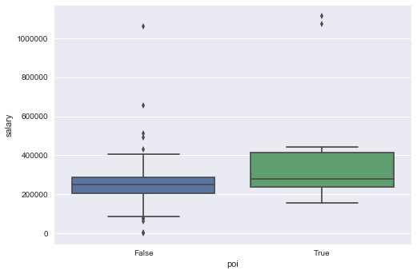


<a id='Bonus'></a>

### Bonus


```python
average_bonus = enron.groupby('poi').mean()['bonus']
average_bonus
```


    poi
    False    9.868249e+05
    True     2.075000e+06
    Name: bonus, dtype: float64


```python
sns.boxplot(x='poi',y='bonus',data=enron)
```


    <matplotlib.axes._subplots.AxesSubplot at 0xe71e710>


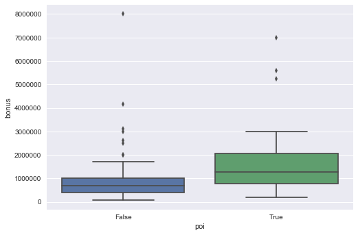


Wow!  An 8 million dollar bonus seems a bit much, but you can see the difference between John and Ken in other ways.  Below, you can see the difference between all other financial features is significant.  And, bonuses among POIs are still higher on average than non-POIs.  So, despite our non-POI outlier, this feature may still be useful in training our algorithm.


```python
enron[(enron['bonus']>6000000)][['name','salary','bonus','exercised_stock_options','restricted_stock','total_stock_value','poi']]
```


<div>
<table border="1" class="dataframe">
  <thead>
    <tr style="text-align: right;">
      <th></th>
      <th>name</th>
      <th>salary</th>
      <th>bonus</th>
      <th>exercised_stock_options</th>
      <th>restricted_stock</th>
      <th>total_stock_value</th>
      <th>poi</th>
    </tr>
  </thead>
  <tbody>
    <tr>
      <th>43</th>
      <td>LAVORATO JOHN J</td>
      <td>339288.0</td>
      <td>8000000.0</td>
      <td>4158995.0</td>
      <td>1008149.0</td>
      <td>5167144.0</td>
      <td>False</td>
    </tr>
    <tr>
      <th>65</th>
      <td>LAY KENNETH L</td>
      <td>1072321.0</td>
      <td>7000000.0</td>
      <td>34348384.0</td>
      <td>14761694.0</td>
      <td>49110078.0</td>
      <td>True</td>
    </tr>
  </tbody>
</table>
</div>


<a id='Total Payments'></a>

### Total Payments


```python
average_total_payments = enron.groupby('poi').mean()['total_payments']
average_total_payments
```


    poi
    False    1.725091e+06
    True     7.913590e+06
    Name: total_payments, dtype: float64


```python
sns.boxplot(x='poi',y='total_payments',data=enron)
```


    <matplotlib.axes._subplots.AxesSubplot at 0xe87dc50>


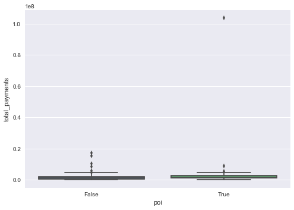


Wow!  That last boxplot has an outlier that is obviously pulling the mean waaaaaaaay up.  Who is that?


```python
enron[(enron['total_payments']>40000000)][['name','total_payments','poi']]
```


<div>
<table border="1" class="dataframe">
  <thead>
    <tr style="text-align: right;">
      <th></th>
      <th>name</th>
      <th>total_payments</th>
      <th>poi</th>
    </tr>
  </thead>
  <tbody>
    <tr>
      <th>65</th>
      <td>LAY KENNETH L</td>
      <td>103559793.0</td>
      <td>True</td>
    </tr>
  </tbody>
</table>
</div>


```python
#take Ken Lay out of the poi boxplot

kl_not_in = enron[(enron['total_payments']<40000000)]

sns.boxplot(x='poi',y='total_payments',data=kl_not_in)
```


    <matplotlib.axes._subplots.AxesSubplot at 0xea389b0>


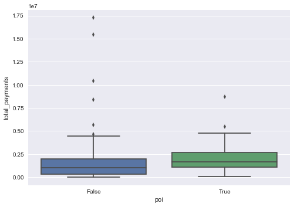


Well, at least now we can see the boxplots more clearly.  There's not much of a difference between POI and non-POI here when we take Ken Lay out, so total_payments probably won't be a feature we'll use.

<a id='Stock Options'></a>

### Exercised Stock Options


```python
average_optionsvalue = enron.groupby('poi').mean()['exercised_stock_options']
average_optionsvalue
```


    poi
    False    1.947752e+06
    True     1.046379e+07
    Name: exercised_stock_options, dtype: float64


```python
sns.boxplot(x='poi',y='exercised_stock_options',data=enron)
```


    <matplotlib.axes._subplots.AxesSubplot at 0xedadb70>


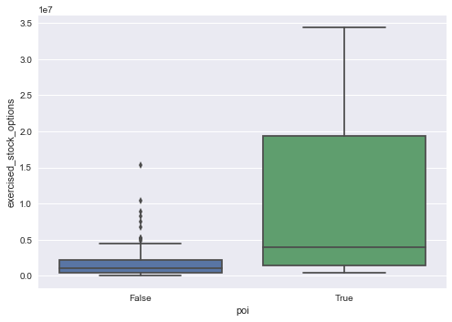


Exercised stock options definitely looks to be higher among POIs, so this will definitely be a feature to include in our list of features for our algorithm.  

<a id='Total BE'></a>

### Total Bonus and Exercised Stock Options


```python
average_total_sbe = enron.groupby('poi').mean()['total_be']
average_total_sbe
```


    poi
    False    1.870028e+06
    True     8.820307e+06
    Name: total_be, dtype: float64


```python
sns.boxplot(x='poi',y='total_be',data=enron)
```


    <matplotlib.axes._subplots.AxesSubplot at 0xec7a6d8>


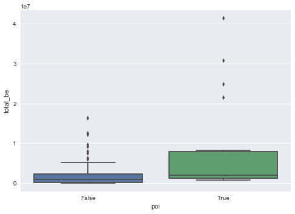


Total Bonus and Exercised Stock Options might be useful, but it might also just add to the noise.  So, maybe we won't use this one.  

<a id='Total Stock Value'></a>

### Total Stock Value


```python
average_stockvalue = enron.groupby('poi').mean()['total_stock_value']
average_stockvalue
```


    poi
    False    2.374085e+06
    True     9.165671e+06
    Name: total_stock_value, dtype: float64


```python
sns.boxplot(x='poi',y='total_stock_value',data=enron)
```


    <matplotlib.axes._subplots.AxesSubplot at 0xeee2b00>


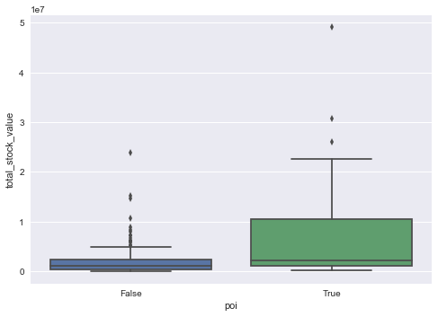


Total stock value for POIs on average is much higher than non-POIs.  This feature is another good option for our POI identifier.

<a id='Total Millions'></a>

### Total Payments and Stock Value in Millions


```python
average_total_comp = enron.groupby('poi').mean()['total_millions']
average_total_comp
```


    poi
    False     3.440052
    True     17.079261
    Name: total_millions, dtype: float64


```python
sns.boxplot(x='poi',y='total_millions',data= enron)
```


    <matplotlib.axes._subplots.AxesSubplot at 0xf3c4b70>


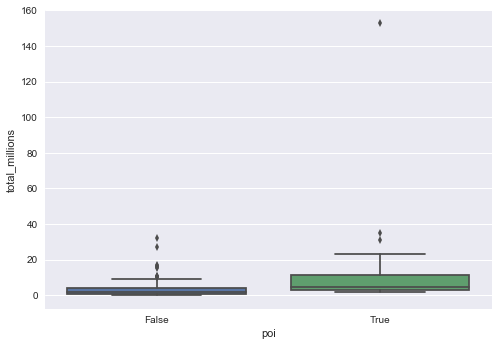


Let's try that one again without Ken Lay...


```python
sns.boxplot(x='poi',y='total_millions',data= kl_not_in)
```


    <matplotlib.axes._subplots.AxesSubplot at 0x1049bdd8>


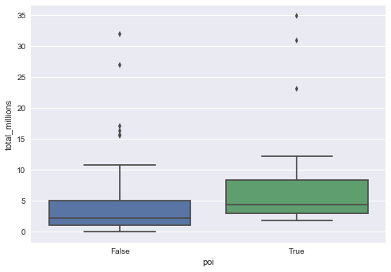


Hmmmm, maybe we didn't need to add this feature.  We can look closer by using lmplot and pairplot later on in our analysis.

<a id='Shared Receipt'></a>

### Shared Receipt with POI


```python
average_shared_receipt = enron.groupby('poi').mean()['shared_receipt_with_poi']
average_shared_receipt
```


    poi
    False    1058.527778
    True     1783.000000
    Name: shared_receipt_with_poi, dtype: float64


```python
sns.boxplot(x='poi',y='shared_receipt_with_poi',data= enron)
```


    <matplotlib.axes._subplots.AxesSubplot at 0x104aa240>


<a id='To Messages'></a>

### To Messages


```python
average_to = enron.groupby('poi').mean()['to_messages']
average_to
```


    poi
    False    2007.111111
    True     2417.142857
    Name: to_messages, dtype: float64


```python
sns.boxplot(x='poi',y='to_messages',data= enron)
```


    <matplotlib.axes._subplots.AxesSubplot at 0x10b2a3c8>


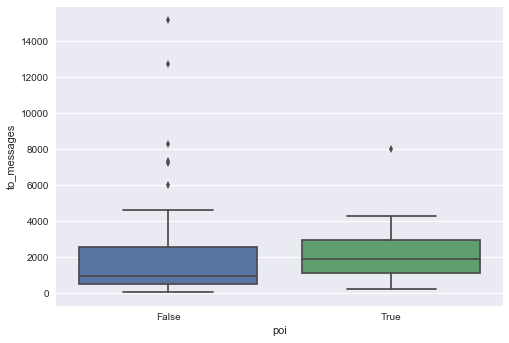


<a id='From Messages'></a>

### From Messages


```python
average_from = enron.groupby('poi').mean()['from_messages']
average_from
```


    poi
    False    668.763889
    True     300.357143
    Name: from_messages, dtype: float64


```python
sns.boxplot(x='poi',y='from_messages',data= enron)
```


    <matplotlib.axes._subplots.AxesSubplot at 0x10bc46d8>


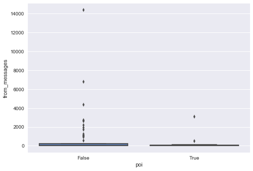


<a id='FTP'></a>

### Fraction to POI


```python
average_fraction_to = enron.groupby('poi').mean()['fraction_to_poi']
average_fraction_to
```


    poi
    False    0.152669
    True     0.345470
    Name: fraction_to_poi, dtype: float64


```python
sns.boxplot(x='poi',y='fraction_to_poi',data= enron)
```


    <matplotlib.axes._subplots.AxesSubplot at 0x10b839e8>


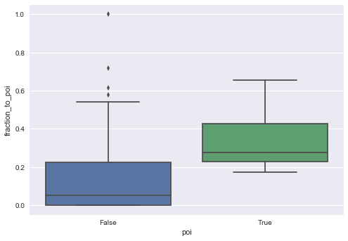


Fraction_to_poi looks like a good feature to add to our list, since most of the poi distribution is in the upper range of the non-poi distribution.

<a id='FFP'></a>

### Fraction from POI


```python
average_fraction_from = enron.groupby('poi').mean()['fraction_from_poi']
average_fraction_from
```


    poi
    False    0.036107
    True     0.047507
    Name: fraction_from_poi, dtype: float64


```python
sns.boxplot(x='poi',y='fraction_from_poi',data= enron)
```


    <matplotlib.axes._subplots.AxesSubplot at 0x10f822b0>


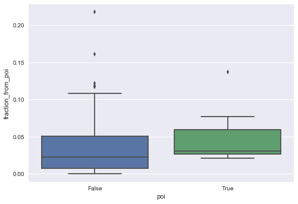


[Top](#top)

<b>Pairplot Analysis</b>

Now, let's take a look at some of our features in the following pairplot.  Maybe it will help us make our final decisions for our features list.


```python
import seaborn as sns; sns.set(style="ticks", color_codes=True)

g = sns.pairplot(enron, vars=['bonus','exercised_stock_options','from_messages','fraction_to_poi'], \
                 dropna=True, diag_kind='kde', hue='poi', markers=['x','o'])
```

    C:\Users\maris_000\Anaconda2\lib\site-packages\statsmodels\nonparametric\kde.py:454: RuntimeWarning: invalid value encountered in greater
      X = X[np.logical_and(X>clip[0], X<clip[1])] # won't work for two columns.
    C:\Users\maris_000\Anaconda2\lib\site-packages\statsmodels\nonparametric\kde.py:454: RuntimeWarning: invalid value encountered in less
      X = X[np.logical_and(X>clip[0], X<clip[1])] # won't work for two columns.
    


<a id='Outliers'></a>

## Outliers

When looking at the stats for poi and non-poi for the first time, I noticed that the non-poi stats were much higher than the poi stats.  That's when I remembered I didn't account for the "TOTAL" key.  So, I went back and skipped over that key when writing to my csv.  I figured I'd just pop it out of my dictionary later if I need to.  After doing that, my stats were as expected.  Now, let's see what other outliers we can find.  In the pairplot above, there were two POIs that really stood out.  Let's take a closer look in the following lmplot.


```python
sns.lmplot(x='bonus', y= 'salary', hue='poi', data=enron, palette='Set1',size=10,markers=['x','o'])
plt.title('Salary/Bonus for POI and non-POI', fontsize=18)
plt.xlabel('Bonus', fontsize=16)
plt.ylabel('Salary', fontsize=16)

```


    <matplotlib.text.Text at 0x12dc08d0>


```python
#Who are the two outliers in blue with the high salary AND high bonus?  Ken Lay and Jeff Skilling of course!

enron[(enron['salary']>1000000)&(enron['bonus']>5000000)][['name','salary','bonus']]
```


<div>
<table border="1" class="dataframe">
  <thead>
    <tr style="text-align: right;">
      <th></th>
      <th>name</th>
      <th>salary</th>
      <th>bonus</th>
    </tr>
  </thead>
  <tbody>
    <tr>
      <th>65</th>
      <td>LAY KENNETH L</td>
      <td>1072321.0</td>
      <td>7000000.0</td>
    </tr>
    <tr>
      <th>95</th>
      <td>SKILLING JEFFREY K</td>
      <td>1111258.0</td>
      <td>5600000.0</td>
    </tr>
  </tbody>
</table>
</div>


These are two of our persons of interest, so we definitely don't want to take them out of our dataset.  

According to [Executive Excess 2002](http://d3n8a8pro7vhmx.cloudfront.net/ufe/legacy_url/629/Executive_Excess_2002.pdf?1448073268)
>Top executives at 23 companies under investigation for their accounting practices earned far more during the
past three years than the average CEO at large companies. CEOs at the firms under investigation earned an
average of 62.2 million dollars during 1999-2001, 70 percent more than the average of 36.5 million dollars for all
leading executives for that period.

<b>Money and Messages Regression Model</b>


```python
sns.lmplot(x='bonus', y='fraction_to_poi', hue='poi', data=enron, palette='Set1',size=10,markers=['x','o'])
plt.title('Money & Messages', fontsize=18)
```


    <matplotlib.text.Text at 0x14151390>


[Top](#top)

<a id='TSS'></a>

## Transform, Select, and Scale

Now let's transform, select, and scale our features.  


```python
# %load 'poi_id.py'
#!/usr/bin/python

import sys
import pickle
sys.path.append("../tools/")

from feature_format import featureFormat, targetFeatureSplit
from tester import dump_classifier_and_data
```

    C:\Users\maris_000\Anaconda2\lib\site-packages\sklearn\cross_validation.py:44: DeprecationWarning: This module was deprecated in version 0.18 in favor of the model_selection module into which all the refactored classes and functions are moved. Also note that the interface of the new CV iterators are different from that of this module. This module will be removed in 0.20.
      "This module will be removed in 0.20.", DeprecationWarning)
    


```python
features_full_list = enron.columns.tolist()
features_full_list.pop(0) #take out 'name'
features_full_list.pop(19) #take out 'email_address'
features_full_list
```


    ['salary',
     'to_messages',
     'deferral_payments',
     'total_payments',
     'exercised_stock_options',
     'bonus',
     'restricted_stock',
     'shared_receipt_with_poi',
     'restricted_stock_deferred',
     'total_stock_value',
     'expenses',
     'loan_advances',
     'from_messages',
     'other',
     'from_this_person_to_poi',
     'poi',
     'director_fees',
     'deferred_income',
     'long_term_incentive',
     'from_poi_to_this_person',
     'total_be',
     'fraction_to_poi',
     'fraction_from_poi',
     'total_millions']


```python
### Remove outliers that corrupt the data
enron_dict.pop('TOTAL', 0)
```


    {'bonus': 97343619,
     'deferral_payments': 32083396,
     'deferred_income': -27992891,
     'director_fees': 1398517,
     'email_address': 'NaN',
     'exercised_stock_options': 311764000,
     'expenses': 5235198,
     'from_messages': 'NaN',
     'from_poi_to_this_person': 'NaN',
     'from_this_person_to_poi': 'NaN',
     'loan_advances': 83925000,
     'long_term_incentive': 48521928,
     'other': 42667589,
     'poi': False,
     'restricted_stock': 130322299,
     'restricted_stock_deferred': -7576788,
     'salary': 26704229,
     'shared_receipt_with_poi': 'NaN',
     'to_messages': 'NaN',
     'total_payments': 309886585,
     'total_stock_value': 434509511}


```python
### Create new feature(s)

#add fraction of emails from and to poi
#idea for this added feature taken from course materials

def computeFraction( poi_messages, all_messages ):
    """ given a number messages to/from POI (numerator) 
        and number of all messages to/from a person (denominator),
        return the fraction of messages to/from that person
        that are from/to a POI
   """
    fraction = 0.
    if poi_messages != 'NaN' and all_messages != 'NaN':
        fraction = float(poi_messages)/all_messages


    return fraction
```


```python
for name in enron_dict:

    data_point = enron_dict[name]

    from_poi_to_this_person = data_point["from_poi_to_this_person"]
    to_messages = data_point["to_messages"]
    fraction_from_poi = computeFraction( from_poi_to_this_person, to_messages )
    
    enron_dict[name]["fraction_from_poi"] = fraction_from_poi
  
    from_this_person_to_poi = data_point["from_this_person_to_poi"]
    from_messages = data_point["from_messages"]
    fraction_to_poi = computeFraction( from_this_person_to_poi, from_messages )

    enron_dict[name]["fraction_to_poi"] = fraction_to_poi

```


```python
#add total_be to dictionary

for name in enron_dict:
    data_point = enron_dict[name]
    
    bonus = data_point['bonus']
    if bonus == 'NaN':
        bonus = 0.0
    options = data_point['exercised_stock_options']
    if options == 'NaN':
        options = 0.0
    total = bonus+options

    enron_dict[name]['total_be'] = total
    
    

```


```python
features = ['fraction_to_poi','total_be']

data = featureFormat(enron_dict, features)

for point in data:
    ftp = point[0]
    tbe = point[1]
    plt.scatter( ftp, tbe )

plt.xlabel("Fraction of Emails to POI")
plt.ylabel("Total Bonus and Stock Options")
plt.show()
```


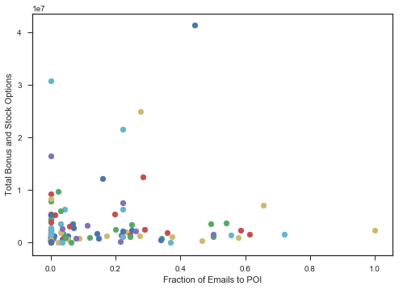


```python
#add total compensation in millions to dataset

for name in enron_dict:
    data_point = enron_dict[name]
    
    total_payments = data_point['total_payments']
    if total_payments == 'NaN':
        total_payments = 0.0
    total_stock = data_point['total_stock_value']
    if total_stock == 'NaN':
        total_stock = 0.0
    total = (total_payments + total_stock)/1000000

    enron_dict[name]['total_millions'] = total
```

<b>SELECT FEATURES</b>

I've selected three lists that may be useful in training our classifiers.  Each of the features selected may be able to give us some insight into the compensation and behavior of a POI.  The total compensation (total_millions) shows us that, on average, POIs are compensated more highly than non-POIs.  The same holds true for individual payments, like salary and bonus.  And, when it comes to stock behavior, POIs are more active in their exercising of stock options(exercised_stock_options.)  Other features, like from_messages, show a kind of pattern in e-mail behavior.  POIs do not send many messages.  However, the ones they do send are often to other POIs(fraction_to_poi).  These are all features we'll test before making our final feature selection.


```python
### Select what features to use

features_final_list = ['poi','bonus','exercised_stock_options','fraction_to_poi']
print "Final List", features_final_list
```

    Final List ['poi', 'bonus', 'exercised_stock_options', 'fraction_to_poi']
    


```python
### Store to my_dataset for easy export below.
my_dataset = enron_dict

### Extract features and labels from dataset for local testing
data = featureFormat(my_dataset, features_final_list, sort_keys = True)
labels, features = targetFeatureSplit(data)
```


```python
#Validation
from sklearn.cross_validation import train_test_split
features_train, features_test, labels_train, labels_test = \
    train_test_split(features, labels, test_size=0.3, random_state=42)
```

<a id="Algorithm"></a>

## Algorithm Selection


```python
### Task 4: Try a variety of classifiers
### Task 5: Tune your classifier


#Start Simple - Naive Bayes
from sklearn.naive_bayes import GaussianNB
clf = GaussianNB()
clf.fit(features_train,labels_train)
pred = clf.predict(features_test)
```

<a id='Metrics'></a>

## Evaluation Metrics


```python
#Evaluation metrics

from sklearn.metrics import accuracy_score
from sklearn.metrics import precision_score
from sklearn.metrics import recall_score

import scikitplot as skplt
```


```python
#accuracy, precision, and recall scores for Naive Bayes Classifier

print accuracy_score(labels_test,pred)
print precision_score(labels_test,pred)
print recall_score(labels_test,pred)
```

    0.868421052632
    0.333333333333
    0.25
    


```python
#take a look at the test labels and the predicted labels

print labels_test
print pred
```

    [0.0, 0.0, 0.0, 0.0, 0.0, 0.0, 0.0, 1.0, 0.0, 0.0, 0.0, 0.0, 0.0, 0.0, 1.0, 0.0, 0.0, 0.0, 0.0, 0.0, 0.0, 0.0, 0.0, 0.0, 0.0, 0.0, 0.0, 0.0, 0.0, 1.0, 0.0, 0.0, 0.0, 0.0, 0.0, 0.0, 1.0, 0.0]
    [ 0.  0.  0.  0.  0.  0.  0.  0.  0.  0.  0.  0.  1.  0.  0.  0.  0.  0.
      0.  0.  0.  0.  1.  0.  0.  0.  0.  0.  0.  1.  0.  0.  0.  0.  0.  0.
      0.  0.]
    


```python
#plot normalized confusion matrix
skplt.metrics.plot_confusion_matrix(labels_test, pred, normalize=True)
```


    <matplotlib.axes._subplots.AxesSubplot at 0x14ce2588>


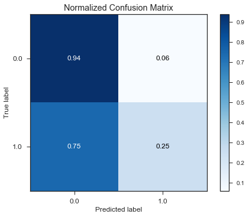


[Top](#top)

<a id="Tuning"></a>

## Tuning

<br>
Let's keep trying other algorithms that we might be able to use as our POI identifier and tune some of the parameters in order to give it a better fit.  We also want to assess for overfitting, so we'll try different combinations of features, classifiers, and parameters until our metrics show us we're on the right track.


```python
#Decision Tree
from sklearn.tree import DecisionTreeClassifier

clf = DecisionTreeClassifier(min_samples_split=2)
clf.fit(features_train,labels_train)
pred = clf.predict(features_test)
```


```python
#print performance metrics

print accuracy_score(labels_test,pred)
print precision_score(labels_test,pred)
print recall_score(labels_test,pred)

#Importance of features
print features_final_list[1:]
print clf.feature_importances_
```

    0.842105263158
    0.333333333333
    0.5
    ['bonus', 'exercised_stock_options', 'fraction_to_poi']
    [ 0.2940794   0.25133001  0.45459059]
    


```python
#plot confusion matrix
skplt.metrics.plot_confusion_matrix(labels_test, pred, normalize=True)
```


    <matplotlib.axes._subplots.AxesSubplot at 0x16633978>


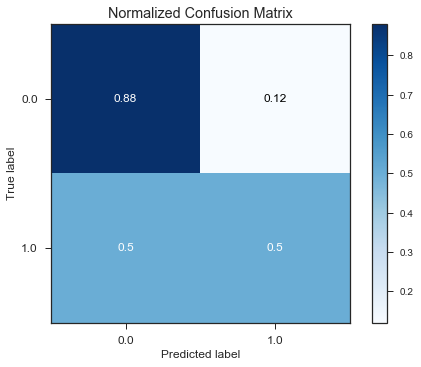


```python
from sklearn.neighbors import KNeighborsClassifier

clf = KNeighborsClassifier()
clf.fit(features_train,labels_train)
pred = clf.predict(features_test)
```


```python
print accuracy_score(labels_test,pred)
print precision_score(labels_test,pred)
print recall_score(labels_test,pred)
```

    0.921052631579
    0.666666666667
    0.5
    


```python
#plot confusion matrix
skplt.metrics.plot_confusion_matrix(labels_test, pred, normalize=True)
```


    <matplotlib.axes._subplots.AxesSubplot at 0x14e57898>


[Top](#top)

<a id="Analysis"></a>

### FINAL FEATURES and ALGORITHM SELECTION

Our final features, based on our feature analysis and testing, will be:

- Bonus
- Exercised Stock Options
- Fraction to POI

I chose the KNeighbors Classifier since supervised learning is best for our dataset, we have a small dataset, and our POI behavior is what we're looking for(similar behavior to 'neighbors'.)  KNearest Neighbors will help us zero in on pockets of POIs/non-POIs within our testing data.  The features I selected work well with this particular classifier because 'bonus' and 'exercised stock options' are good for training the algorithm to pick up on POI compensation trends, and 'fraction_to_poi' will help our algorithm pick up on POI e-mail behavior.  I narrowed it down to three features so as not to create noise.


```python
### Task 6: Dump your classifier, dataset, and features_list 
features_list = features_final_list
dump_classifier_and_data(clf, my_dataset, features_list)
```


```python
#test performance using tester.py

%run 'tester.py'
```

    KNeighborsClassifier(algorithm='auto', leaf_size=30, metric='minkowski',
               metric_params=None, n_jobs=1, n_neighbors=5, p=2,
               weights='uniform')
    	Accuracy: 0.87854	Precision: 0.71113	Recall: 0.35450	F1: 0.47314	F2: 0.39402
    	Total predictions: 13000	True positives:  709	False positives:  288	False negatives: 1291	True negatives: 10712
    
    

<a id='Thoughts'></a>

## Final Thoughts

With an accuracy of 85-95%, precision of 65-75%, and recall of 35-50%, I think our algorithm has done well considering the small amount of data used to train the algorithm.  We only had 18 POIs in our dataset and had to split our data when validating so as not to overfit our classifier.  So, that only gave us 70% of our data to train our algorithm with.  We've done pretty well, but I don't think I'd want to bet anyones life in prison on this algorithm's performance.  We could use more data!  Our Naive Bayes and Decision Tree Classifiers didn't perform as well.  Naive Bayes may have been too simple.  The Decision Tree, given the right parameters (min_samples_split=2), may have worked out.  However, results were not as impressive as our Kneighbors.  Although, overfitting is a problem as you increase the number of 'n_neighbors' in our KNeighbors Classifier.  To avoid this, I kept the default setting of 5.  That left us with a working algorithm and some pretty solid evaluation metrics.  According to our confusion matrix, we were able to identify 97% of non-POIs and 50% of POIs.  I'd rather get a few POIs wrong than falsely identify a non-POI as a POI.  There may come a day when people will be convicted based on machine learning, so it's important that we be as accurate as possible.
